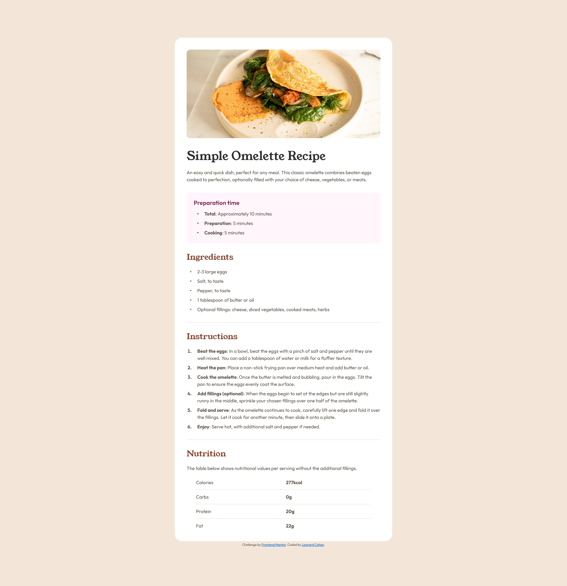

# Frontend Mentor - Recipe page solution

This is a solution to the [Recipe page challenge on Frontend Mentor](https://www.frontendmentor.io/challenges/recipe-page-KiTsR8QQKm). Frontend Mentor challenges help you improve your coding skills by building realistic projects. 

## Table of contents

- [Overview](#overview)
  - [The challenge](#the-challenge)
  - [Screenshot](#screenshot)
  - [Links](#links)
- [My process](#my-process)
  - [Built with](#built-with)
  - [What I learned](#what-i-learned)
  - [Continued development](#continued-development)
- [Author](#author)

## Overview

### Screenshot

### Links

- Solution URL: [https://github.com/lenny131/recipe-page](https://github.com/lenny131/recipe-page)
- Live Site URL: [https://lenny131.github.io/recipe-page](https://lenny131.github.io/recipe-page)

## My process

### Built with

- HTML and CSS

### What I learned

One of the primary goals of this project was to use semantic HTML for all elements. I did use `<b>` for some bolded text, since it seemed more appropriate than using `<strong>`, which has a specific semantic meaning which was not appropriate in this case. I could have also used `` instead, but that would provide even less semantic value.

Styling the lists was somewhat challenging. The bullet points are normally placed outside the left margin of the `<ul>` or `<ol>` element. Setting the `list-style-position` property to `inside` would solve this problem, except this causes multi-line text to wrap around the bullet. I decided to add some left-side padding instead.

Regarding the top image, I considered leaving the alt text blank, but it's unclear if this image should be considered purely decoratave, and after some slight html layout changes it wouldn't benifit from the paragraph description of the recipe. (Although, it's possible that the h1 heading still provides enough information to the user to justify removing the alt text.) Ultimately, I decided to include the alt text to be safe.

### Continued development

Continue learning HTML, CSS, and Javascript; and then learn React.
Also interested in learning more about accessibility.

## Author

- Website - [Leonard Cohen](https://leonardmcohen.com)
- Frontend Mentor - [lenny131](https://www.frontendmentor.io/profile/lenny131)
